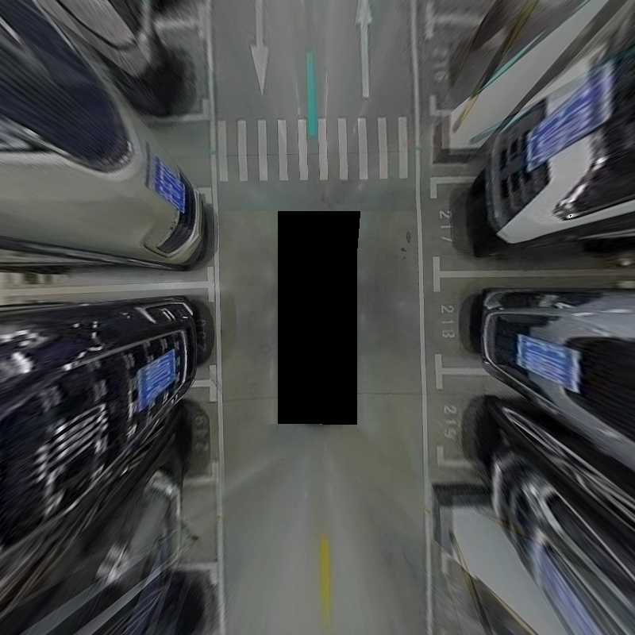
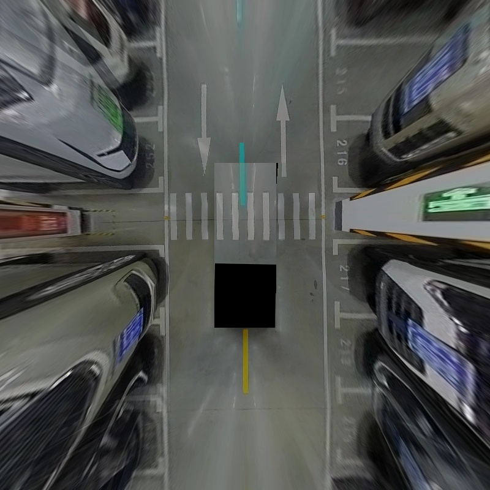
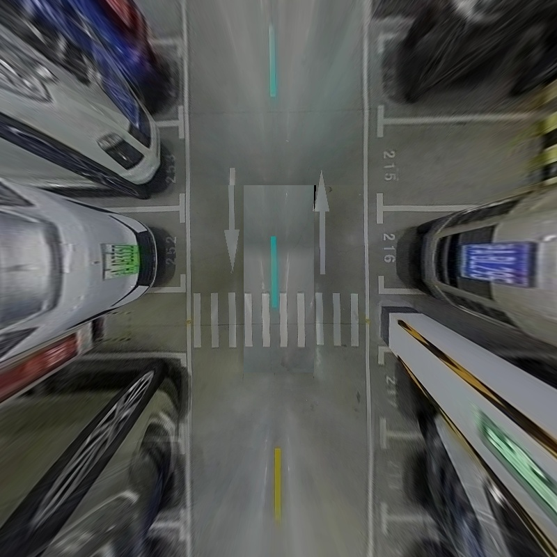

# TransparentChassisCuda

## 1 Requirement
This codebase has been developed with cuda-11.1, OpenCV-3.2.0 and YAML ...

## 2 Installation
### 2.1 Install modules *TransparentChassisCuda*
```
git clone git@github.com:little-bookworm/TransparentChassisCuda.git
cd TransparentChassisCuda
bash build.sh
``` 

## 3 Test
### 3.1 Run test
`
bash run_test.sh
`
### 3.2 Results Visualization
<div align=left>
<div align=left>
<div align=left>